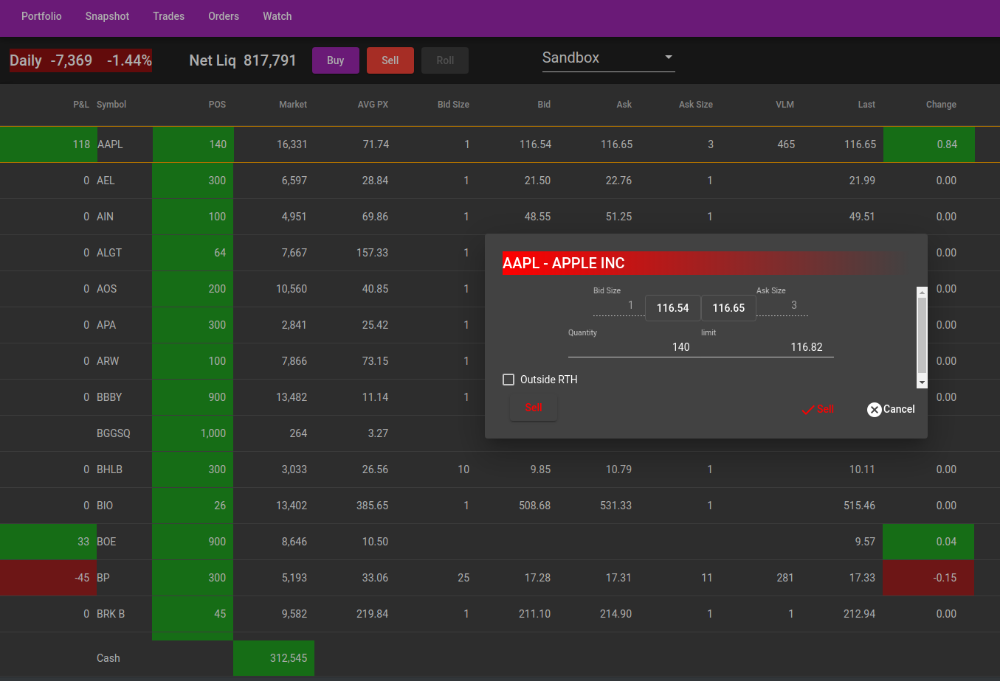
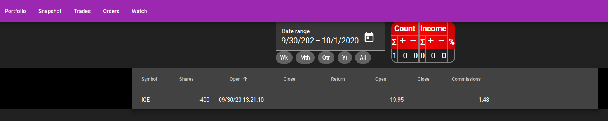
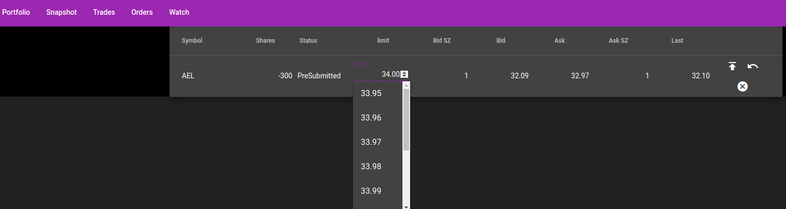
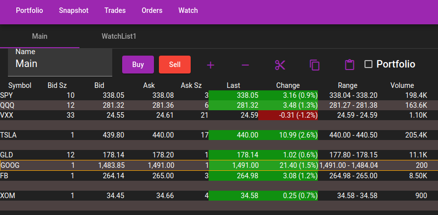
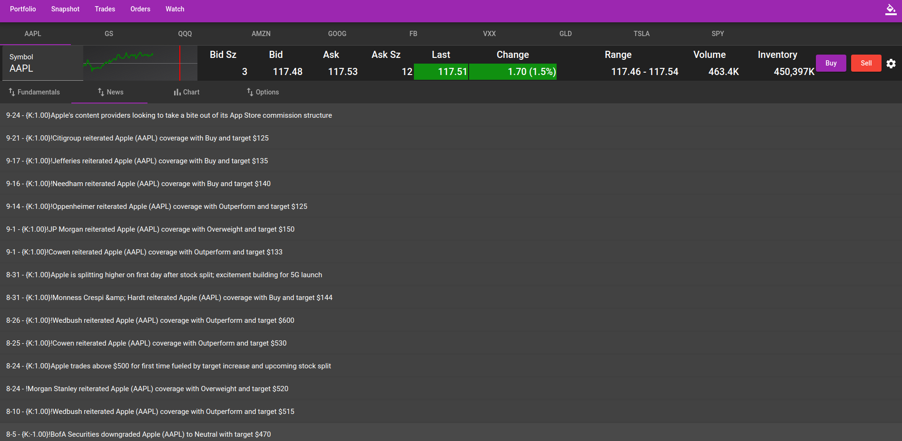
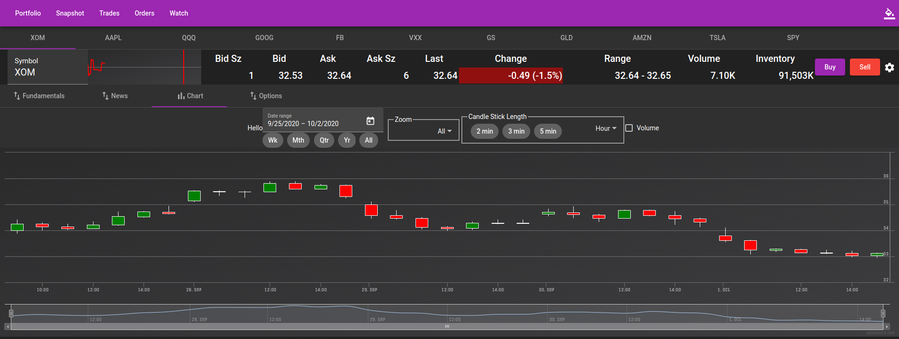
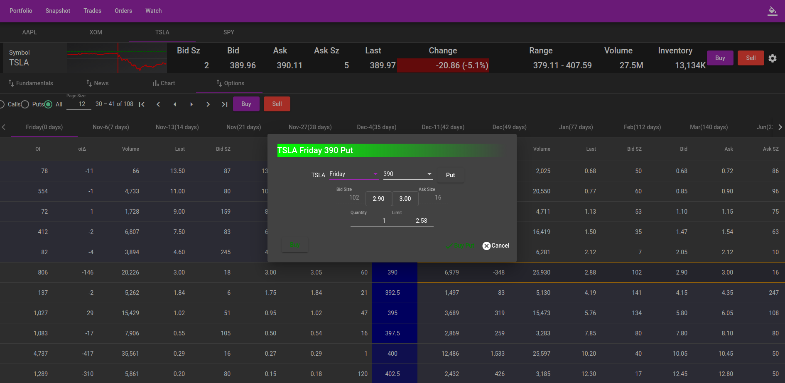

# TwsWebsite - Angular Website.

## Sponsor this project
Links on Right

## Disclaimers
### <ins>High Charts</ins>
The charts utilize highcharts which requires a separate license.  Please see https://shop.highsoft.com/
###  <ins>Interactive Brokers</ins>
This is not associated with Interactive Brokers other than the utilization of the api supplied by Interactive Brokers.
###  <ins>Proof of concept/Alpha version </ins>
Little testing, never utilized in production, no automated tests.
* 20.11 - Improvement to options tab.
* 20.10 - Initial Release
###  <ins>Ports</ins>
Make sure the following ports are secured:
* 7497, 7496, 4001, 4002 - Default ports utilized by TWS workstation or gateway.
* 6811 - Default port utilized between website and server.
* 8080 - Default port utilized by website.

## Windows Installation
1. Run [Setup.msi](https://github.com/Jde-cpp/TwsWebsite/releases).
2. 64-bit TwsSocketClient.dll
    1. Install [Build Tools for Visual Studio](https://visualstudio.microsoft.com/downloads/?q=build+tools#build-tools-for-visual-studio-2022).  Select C++ desktop applications.
	 2. Install [Latest Tws API](https://interactivebrokers.github.io/).
	 3. Run "%ProgramFiles%\jde-cpp\TwsWebSocket\build-tws.bat"
3. [Sql Server Express](https://www.microsoft.com/en-us/sql-server/sql-server-downloads) - From powershell run:
    1. `Invoke-Sqlcmd -Query "create database jde" -ServerInstance localhost`
	 2.  `Add-OdbcDsn -Name "Jde_TWS_Connection" -DriverName "ODBC Driver 17 for SQL Server" -Platform "64-bit" -DsnType "User" -SetPropertyValue @("SERVER=localhost", "Trusted_Connection=Yes", "DATABASE=jde")`
4. node.js
    1. [Install](https://nodejs.org/en/)
	 2.  From the start menu, open 'node.js command prompt' and run:  `npm install --global http-server`

## Running
1.  Start Interactive Brokers TWS Gateway or [Workstation](https://www.interactivebrokers.com/en/trading/tws-updateable-latest.php).
2.  Run TwsWeb.bat on Desktop.
3.  Open browser to http://localhost:8080/portfolio.
### <ins>Settings</ins>
%ProgramData%\jde-cpp\TwsWebSocket.json
* twsWebSocket\accounts fill in account alias:  `["U123": "IRA", "U456": "Sandbox"]`

## Screenshots

