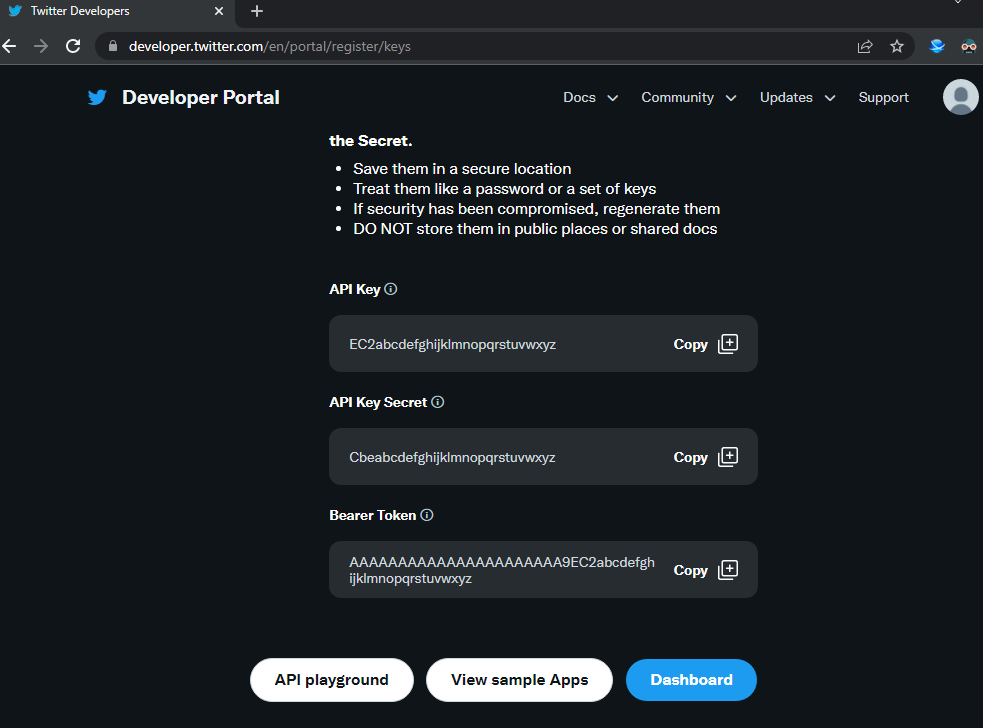
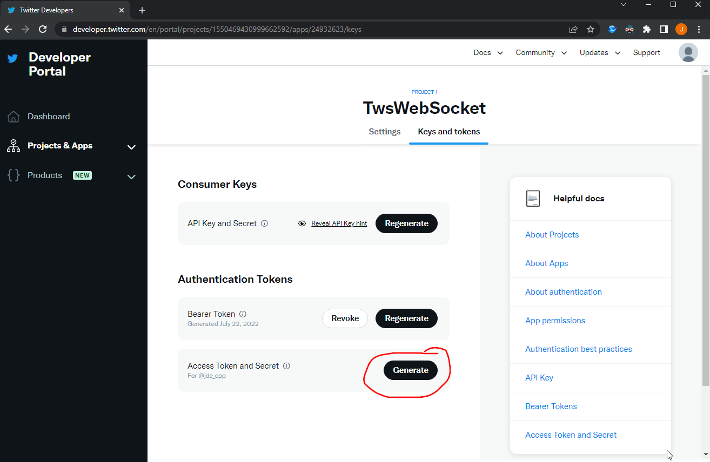

# Twitter Setup
1.  [Create Twitter Developer account](https://developer.twitter.com/)
2.  Create Application 
3.  Save Keys 
    ```
    setx TwitterApiKey EC2abcdefghijklmnopqrstuvwxyz
    setx TwitterBearerToken Cbeabcdefghijklmnopqrstuvwxyz
    setx TwitterApiKeySecret AAAAAAAAAAAAAAAAAAAAAA9EC2abcdefghijklmnopqrstuvwxyz 
    ```
4. For writable access (used to block users) 
    ```
    setx TwitterAccessToken 2665789512345678901-K7abcdefghij8GbsqRABCdefghijk8
    setx TwitterAccessTokenSecret e123456abcdefghijklomnopqrstuvwzyz123456789xx
    ```

